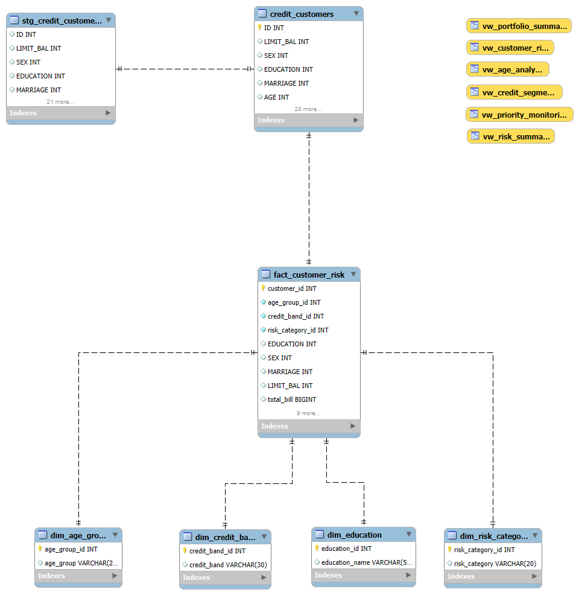

# Credit Card Portfolio Risk Analytics Dashboard

An end-to-end **SQL + Power BI** project analyzing **30,000 credit card customers** to identify default risk, monitor portfolio exposure, segment customers, and support credit risk decision-making.

---

## Overview

| | |
|---|---|
| **Objective** | Give portfolio and risk executives a single view of default risk, exposure concentration, and customer segments driving losses |
| **Portfolio size** | ~30,000 customers |
| **Tools** | Power BI (data modeling, DAX, visualization), SQL (data preparation) |
| **Pages** | 3 — Executive Overview, Customer Behaviour & Risk Drivers, Actionable Risk Insights |

---

# Dataset

**Source**

Default of Credit Card Clients Dataset

UCI Machine Learning Repository

https://archive.ics.uci.edu/dataset/350/default+of+credit+card+clients

Dataset Size:

- 30,000 customers
- 24 original variables
- Binary default target

---
# Project Workflow

```
Raw CSV Dataset
        │
        ▼
Staging Table
        │
        ▼
Data Cleaning
        │
        ▼
Feature Engineering
        │
        ▼
Fact & Dimension Tables
        │
        ▼
Analytical SQL Views
        │
        ▼
Power BI Dashboard
        │
        ▼
Business Insights
```

---

# SQL Workflow

The project consists of five major SQL stages:

### 1. Database Creation

- Database creation
- Table design
- Data import

### 2. Data Cleaning

- Data validation
- Duplicate checks
- Null handling
- Data type corrections

### 3. Feature Engineering

Created business-ready variables including:
- Total Bill
- Total Payment
- Payment Ratio
- Age Group
- Credit Band
- Risk Score
- Risk Category
- Maximum Payment Delay

### 4. Business Analysis

SQL queries answering questions such as:

- Overall default rate
- Default rate by gender
- Default rate by education
- Default rate by age
- Credit band analysis
- Portfolio exposure
- Customer segmentation

### 5. Analytical Views

Created reusable SQL Views including:
- Portfolio Summary
- Customer Risk
- Credit Segments
- Risk Summary
- Priority Monitoring
- Age Analysis

---

## Database Design

The project follows a simple dimensional model.


## Dashboard pages

### 1. Executive Portfolio Overview
KPIs for Total Customers, Total Defaulters, Default Rate, Portfolio
Exposure, Average Credit Limit, and Average Payment Ratio, alongside risk
category distribution, default rate by credit band, default rate by
gender & marital status, and default rate by education & age group.
Vertically stacked slicers (Age Group, Credit Band, Gender, Risk Category)
drive all visuals on the page.


### 2. Customer Behaviour & Risk Drivers
KPIs for High/Medium/Low Risk Customers and Average Risk Score. Visuals
include a Default Rate vs. Credit Limit combo chart with an overlaid
payment-ratio trend line, a Payment Ratio vs. Total Bill scatter plot
(bubble size = credit limit, color = risk category), default rate by risk
score, and average delay and average payment ratio broken down by risk
category — showing that payment behavior degrades consistently as risk
increases.


### 3. Actionable Risk Insights
KPIs for Customers Requiring Monitoring, High Exposure Customers,
Portfolio Exposure, and Average Delay. Includes a Priority Monitoring
table (ranked by risk score, filtered to exclude records with missing
payment data), exposure and average exposure by risk category, a ranked
list of the Top 20 high-exposure and high-risk customers, and a
recommendation panel summarizing key portfolio-level findings for
executive action.


---

## Key insights

- Overall portfolio default rate is 22.12%.
- Low Risk customers account for the largest share of total portfolio exposure.
- Higher repayment delays correspond to higher default risk.
- Customers with lower payment ratios consistently exhibit higher risk scores.
- High exposure accounts require periodic review despite lower default probability.
-  ~700 customers (2.3% of the portfolio) have made zero payments
  against their outstanding balance isolated by risk and
  exposure in the Priority Monitoring table. Immediate collections
  outreach is recommended starting with the top 20 combined high-risk /
  high-exposure accounts.
- High-risk customers carry nearly as much exposure per account as
  low-risk customers (avg. NT$0.24M vs. NT$0.29M) despite representing
  only ~4% of the customer base. Thus, exposure controls need to scale with
  risk category not just account size.
  - Default rate rises with age, peaking in the 60+ segment, and is
  highest among High School-educated, Single customers. 
- Exposure remains concentrated in Low and Medium risk tiers (NT$5.7bn + NT$2.1bn of NT$8.1bn total),
  but the Medium tier customers represent an opportunity for early intervention before transitioning into the High Risk segment.

---

## Data & methodology

- Source data cleaned and prepared via SQL (see `sql/`) before loading
  into Power BI's data model.
- Risk Category and Credit Band are pre-classified segments; Default
  Rate, Payment Ratio, Average Delay, and exposure metrics are calculated
  via DAX measures in the semantic model.
- A `Payment Status` column explicitly separates true zero-payment
  records from missing/null payment data (~3% of the portfolio), so
  incomplete records aren't misread as high-risk defaulters in the
  Priority Monitoring table or KPIs.
- Risk Category ordering (High → Medium → Low) is enforced via a
  `Risk Category Rank` helper column, avoiding default alphabetical
  sorting in tables and axes.

---

## Repository structure

```
credit-card-portfolio-risk-analytics/
├── README.md
├── powerbi/
│   ├── CreditRiskDashboard.pbip
│   ├── CreditRiskDashboard.Report/
│   └── CreditRiskDashboard.SemanticModel/
├── sql/
│   ├── 01_create_tables.sql
│   ├── 02_data_cleaning.sql
│   └── 03_risk_metrics.sql
├── theme/
│   └── CreditRisk_Executive_Theme.json
├── docs/
│   └── design_spec.md
└── screenshots/
    ├── page__1.png
    ├── page_2.png
    └── page_3.png
```


## Tech stack

`Power BI` `DAX` `SQL` `Data Modeling` `Risk Analytics`

---

## Author

Haripriya Nair — Madras School of Economics
